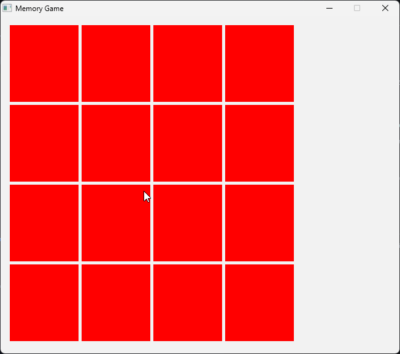
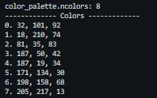
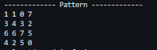

# C++ Memory Game

A simple game made with C/C++ SDL2.

## Description

<div align="center">
  

  _Project Demo_
</div>

This project was built with the Simple DirectMedia Layer (SDL) Library, version 2.0.16. This project is a demonstration of the capabilities of what can be done using the SDL library. This project randomly genrates color-pair for each game instance. It will log the colors generated at launch which can be seen through CLI.

<div align="center">
  
  

  _CLI Log_
</div>


## Getting Started

### Dependencies

The following dependencies are what was used during development:

* OS: Windows 10/11
* Compiler: GCC 14.2 (i686_posix release; see releases [here](https://github.com/niXman/mingw-builds-binaries/releases))
* Library: 
    - SDL2 2.0 
    - SDL2 ttf

_\* see the official [SDL2 Release logs](https://github.com/libsdl-org/SDL/releases) for updated versions of the library and dependencies, for old versions of SDL TTF here is the [official source](https://www.libsdl.org/projects/SDL_ttf/release/)._

\* I have included a basic font in ths repository in `src/Fonts`.

<!-- ### Installing

* How/where to download your program
* Any modifications needed to be made to files/folders -->

### Executing program

1. Assuming you have installed all necessary libraries and compilers, run:
```
> make
```

## Authors

* [@AloysiusButac](https://github.com/AloysiusButac) (email: aloysiusbutac@gmail.com)

<!-- ## Version History

* 0.2
    * Various bug fixes and optimizations
    * See [commit change]() or See [release history]()
* 0.1
    * Initial Release -->